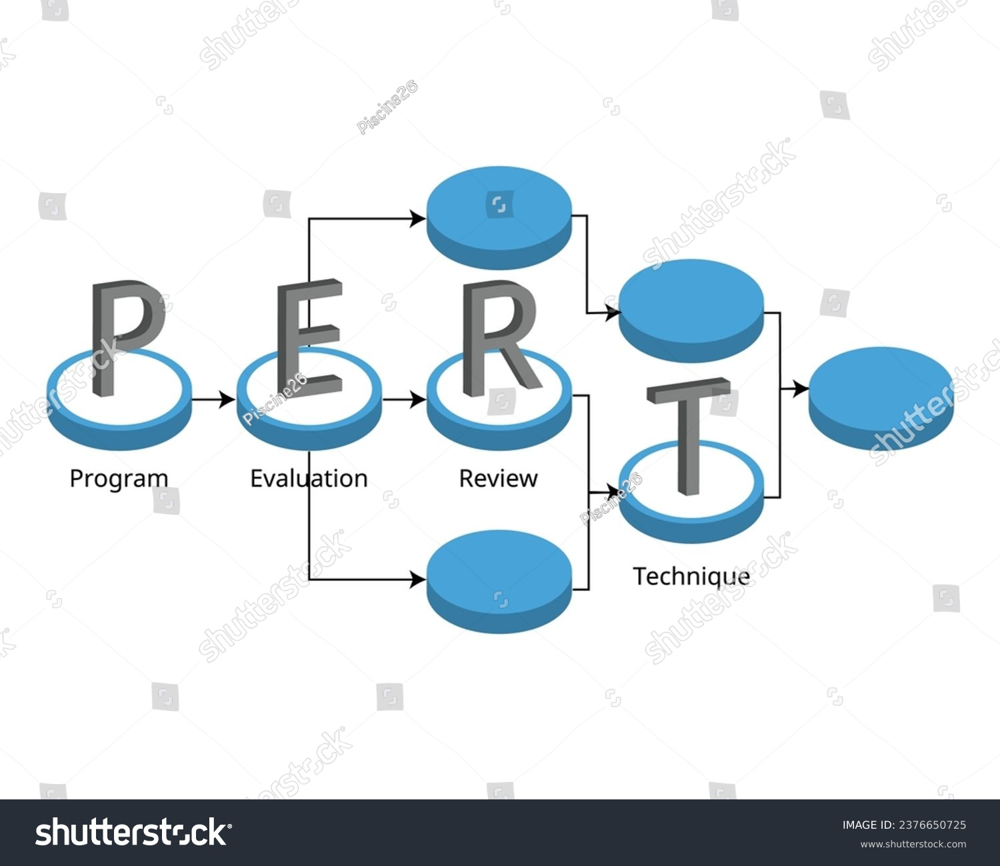

# 📊 Solar Farm Construction Project: PERT/CPM Analysis  
**Company**: NovaSol Energy  
**Goal**: Optimize the 50MW solar farm construction timeline using Project Evaluation and Review Technique (PERT) and Critical Path Method (CPM).  


## 🔍 Overview  
- **Business Problem**: Delays in renewable energy projects lead to financial penalties and missed incentives.  
- **Solution**: Identify the critical path, estimate project duration, and calculate completion probabilities to mitigate risks.

### Project Management Questions: 
1. Construct the project network.
2. d the expected duration and variance of each activity (using PERT: *Expected = (a + 4m + b)/6*, *Variance = [(b – a)/6]²*).
3. d the critical path and expected project completion time.
4. Probability of completing the project on or before 19 weeks?
5. If the probability is 0.85, find the expected project completion time.



## 📂 Repository Structure

solar-farm-project/

├── docs/ # Project documentation
├── notebooks/ # Interactive analysis (Jupyter)
├── outputs/ # Results (graphs, tables)
├── scripts/ # Python scripts
├── README.md # You are here
├── requirements.txt # Dependencies

# 🌱 Business Context: NovaSol Energy  
**Project**: Construction of a 50MW solar farm in a rural area.  
**Business Case**: You can access the business case [here](https://github.com/paragon-tech001/NovaSol-Solar-Farm-Construction-Project-PERT-CPM-Analysis/blob/main/PERT%20-%20%20Business%20Case.pdf)


## ⚡ Why This Matters  
- Renewable energy projects face delays due to permitting, supply chains, and weather.  
- **Critical path analysis** helps prioritize high-impact activities.  

## 📋 Activity Mapping  
| Activity | Real-World Task                  | Predecessors | Optimistic (a) | Most Likely (m) | Pessimistic (b) |
|----------|----------------------------------|--------------|----------------|------------------|------------------|
| A        | Land Survey & Permitting         | None         | 2              | 2                | 8                |
| B        | Solar Panel Procurement          | None         | 1              | 2                | 3                |
| ...      | ...                              | ...          | ...            | ...              | ...              |

# 📐 Methodology: PERT/CPM Analysis

## 1. PERT Calculations  
For each activity:  

- **Expected Time (Mean)**: 
   
  ```math
  \text{Mean} = \frac{a + 4m + b}{6}

 ```math
  \text{Variance} = \left(\frac{b - a}{6}\right)^2 

``` 

## 2. Critical Path Method (CPM)

- Forward Pass: Calculate earliest start/finish times.
- Backward Pass: Calculate latest start/finish times.
- Slack: Activities with zero slack are critical.
  
## 3. Probability Analysis

Used the normal distribution (Z-scores) to estimate completion probabilities.


---

## 4. **`scripts/network_analysis.py`**  

```python
"""
Part (a): Construct and visualize the project network using NetworkX.
Input: Activity dictionary with predecessors and durations.
Output: Network graph (saved to outputs/network_graph.png).
"""
import networkx as nx
import matplotlib.pyplot as plt

# Define activities, predecessors, and durations (a, m, b)
activities = {
    'A': {'predecessors': [], 'duration': (2, 2, 8)},
    'B': {'predecessors': [], 'duration': (1, 2, 3)},
    'C': {'predecessors': [], 'duration': (1, 5, 9)},
    'D': {'predecessors': ['A'], 'duration': (1, 2, 9)},
    'E': {'predecessors': ['B'], 'duration': (1, 2, 3)},
    'F': {'predecessors': ['B'], 'duration': (1, 2, 3)},
    'G': {'predecessors': ['C'], 'duration': (1, 4, 7)},
    'H': {'predecessors': ['D', 'E', 'F', 'G'], 'duration': (6, 7, 8)},
    'I': {'predecessors': ['F', 'G'], 'duration': (1, 2, 9)},
}

G = nx.DiGraph()

# Add nodes and edges to the graph

for activity, details in activities.items():
    G.add_node(activity, duration=details['duration'])
    for predecessor in details['predecessors']:
        G.add_edge(predecessor, activity)
        
# Draw the graph
pos = nx.spring_layout(G, seed=42) # positions for all nodes
plt.figure(figsize=(12, 8))
nx.draw(G, pos, with_labels=True, node_size=2000, node_color='lightblue', font_size=10, font_color='black', font_weight='bold', arrows=True)
# edge_labels = {(u, v): f"{G.nodes[v]['duration']}" for u, v in G.edges()}
# nx.draw_networkx_edge_labels(G, pos, edge_labels=edge_labels, font_color='red', font_size=8)
plt.title("Solar Farm Project Network (Novasol Energy)", fontdict={'fontsize': 14, 'fontweight': 'bold'})

```


## 5. **`scripts/pert_analysis.py`**
``` python
"""
Parts (b)-(e): PERT/CPM calculations and probability analysis.
Input: Activity durations and dependencies.
Output: Critical path, project duration, and probabilities.
"""
# Define a function to calculate expected duration and variance

def pert_mean_variance(a, m, b):
    """
    Calculate the mean and variance using PERT formula.
    
    Parameters:
    a (float): Optimistic duration
    m (float): Most likely duration
    b (float): Pessimistic duration
    
    Returns:
    tuple: mean and variance
    """
    expected_duration = (a + 4 * m + b) / 6
    variance = ((b - a) / 6) ** 2
    return expected_duration, variance)

import pandas as pd

# Convert activities dictionary to DataFrame

df = pd.DataFrame.from_dict(activities, orient= 'index')
# This line splits the 'duration' tuple column into three separate columns: 'a', 'm', and 'b'
# For each row, it takes the tuple in 'duration' (e.g., (2, 2, 8)), and assigns the first value to 'a', second to 'm', and third to 'b'
df[["a", "m", "b"]] = pd.DataFrame(df["duration"].tolist(), index=df.index)
df.drop(columns = ["duration"], inplace=True)

# Apply the PERT function row-wise to calculate expected duration and variance
df[['mean', 'variance']] = df.apply(lambda row: pert_mean_variance(row['a'], row['m'], row['b']), axis=1, result_type='expand')

# Forward pass (earliest start times/ finish times)
earliest_start = {activity : 0 for activity in activities}
earliest_finish = {}

for activity in nx.topological_sort(G):
    max_predecessor_finish = 0
    for pred in G.predecessors(activity):
        max_predecessor_finish = max(max_predecessor_finish, earliest_finish[pred])
    a, m, b = activities[activity]['duration']
    mean, _ = pert_mean_variance(a, m, b)
    earliest_start[activity] = max_predecessor_finish
    earliest_finish[activity] = earliest_start[activity] + mean 

project_duration = max(earliest_finish.values())

# Backward pass (latest start times/ finish times)


latest_finish = {activity: project_duration for activity in activities}
latest_start = {}

for activity in reversed(list(nx.topological_sort(G))):
    min_successor_start = project_duration
    for succ in G.successors(activity):
        min_successor_start = min(min_successor_start, latest_start.get(succ, project_duration))
    a, m, b = activities[activity]['duration']
    mean, _ = pert_mean_variance(a, m, b)
    latest_finish[activity] = min_successor_start
    latest_start[activity] = latest_finish[activity] - mean
    


# Identify critical path (zero slack activities)
critical_path = []
for activity in activities:
    slack = latest_start[activity] - earliest_start[activity]
    if slack == 0:
        critical_path.append(activity)
        
# Print the critical path and project duration
print("Critical Path:", " -> ".join(critical_path))
print("Total Project Duration:", project_duration, 'weeks')
# For each activity, calculate the slack (difference between latest and earliest start times)
# If slack is zero, the activity is on the critical path and is added to the critical_path list
print("Critical Path:", " -> ".join(critical_path))
print("Total Project Duration:", project_duration, 'weeks')

# 1. Import the normal distribution from scipy.stats
#    This is used to calculate the cumulative distribution function (CDF) for the probability calculation.
from scipy.stats import norm

# 2. Calculate the total variance along the critical path.
#    For PERT, the variance of the project duration is the sum of the variances of the activities on the critical path.
#    Formula for variance of an activity: variance = ((b - a) / 6) ** 2
critical_var = sum(
    pert_mean_variance(*activities[activity]['duration'])[1] for activity in critical_path
)
print("Critical Path Variance:", critical_var)

# 3. Calculate the z-score for the desired completion time (19 weeks).
#    Formula: z = (T - μ) / σ
#    Where:
#      - T is the target completion time (19 weeks)
#      - μ is the expected project duration (project_duration)
#      - σ is the standard deviation (sqrt of critical_var)
z_score = (19 - project_duration) / (critical_var ** 0.5)

# 4. Calculate the probability of completing the project in <= 19 weeks.
#    This uses the cumulative distribution function (CDF) of the normal distribution.
probability = norm.cdf(z_score)

print(f"Probability of completion in <= 19 weeks: {probability:.4f}")

z_85 = norm.ppf(0.85)  # z-score for 85% probability
# Calculate the completion time for 85% probability.
completion_time_85 = project_duration + z_85 * (critical_var ** 0.5)
print(f"Completion time for 85% probability: {completion_time_85:.2f} weeks, which is approximately {completion_time_85:.0f} weeks")

```

## 📝 Results Summary  

### Critical Path  
- **Activities**: C → G → H  
- **Expected Project Duration**: 16 weeks  

### Probabilities  
- **P(≤19 weeks)**: 96.12%  
- **85% Confidence Time**: 18 weeks  

### Activity Metrics  
| Activity | Mean (weeks) | Variance |
|----------|--------------|----------|
| A        | 3.00         | 1.00     |
| B        | 2.00         | 0.11     |
| ...      | ...          | ...      |


## 📈 Key Results  
| Metric                          | Value             |  
|---------------------------------|-------------------|  
| Expected Project Duration       | 16 weeks          |  
| Critical Path                   | C → G → H         |  
| Variance of Critical Path       | 2.89 weeks²       |  
| P(Completion ≤19 weeks)         | 96.12%             |  
| 85% Confidence Completion Time  | 18 weeks       |  
    


